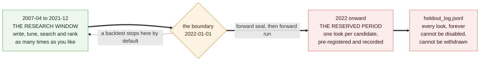
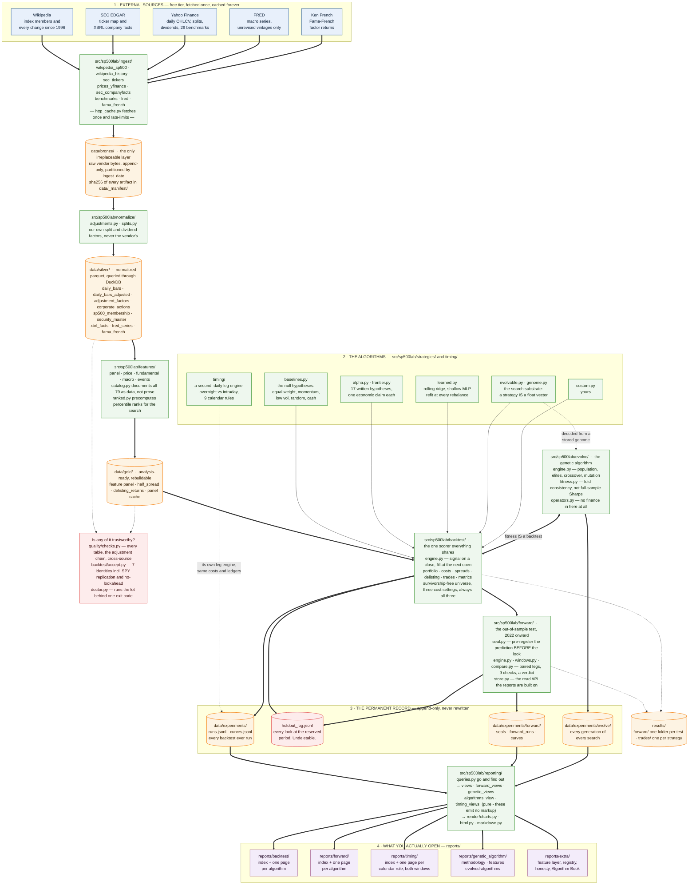

# The project, on one page

Everything this repository does, from a free web page to a self-contained HTML report, and
where each piece lives on disk.

The picture below is rendered from [`project-map.mmd`](project-map.mmd) and checked in as
[`project-map.svg`](project-map.svg). It is 2257 x 2465 px, so open the SVG on its own to
read it at full size; it is vector and scales without blurring. The same source is in a
fenced block near the end of this page, which renders natively on GitHub and in most
Markdown editors.



---

## Read it in one paragraph

Five free sources are fetched once and written to **bronze** as raw bytes with a checksum,
because bronze is the only layer that cannot be rebuilt. Bronze is parsed and conformed
into **silver** parquet, with corporate-action factors computed here rather than taken from
the vendor. Silver becomes the shared **feature layer** and the **gold** panels the engine
reads. Every strategy - the null baselines, the seventeen written hypotheses, the learned
models, the genetic algorithm's genomes and the calendar rules - is scored by the *same*
backtest engine, which is what makes the scoreboard mean anything. Every run is logged as a
trial, every look at the reserved period after 2022 is recorded and cannot be withdrawn,
and the **forward** package spends that period as a pre-registered paired comparison. The
**reporting** package reads those records, never the engine, and writes the folders under
`reports/` that you actually open.

## The five kinds of box

| Colour | Means |
|---|---|
| Blue | An external source. Free tier, fetched once, never trusted twice. |
| Green | Code, under `src/sp500lab/`. |
| Amber | Stored data, under `data/` or `results/`. Cylinders are append-only records. |
| Red | A guard: something whose job is to refuse a bad number. |
| Purple | Generated output under `reports/` - the thing a person reads. |

## Three claims the arrows are making

**Every layer below bronze is disposable.** Silver rebuilds from bronze, gold rebuilds from
silver, the reports rebuild from the registry. Only `data/bronze/` and `data/experiments/`
are irreplaceable, and both are append-only.

**The genetic algorithm is not a separate system.** The double-headed arrow between
`evolve/` and the engine is the whole design: a search's fitness function *is* a backtest,
so an evolved strategy is scored by exactly the same accounting, the same costs and the
same survivorship-free universe as a hand-written one. The scoreboard cannot tell them
apart.

**Reports read records, not the engine.** Everything under `reports/forward/` and
`reports/genetic_algorithm/` is built from stored records with no backtest and no panel,
which is what lets a report be rebuilt years later from the record alone. `reports/timing/`
is the one exception and says so: a calendar rule with no research-window row yet gets one,
logged under the study `reports`, and its forward half still comes entirely from the store.

---

## Where to find things

### Code - `src/sp500lab/`

| Folder | What lives there | Read |
|---|---|---|
| `ingest/` | One module per source: `wikipedia_sp500`, `wikipedia_history`, `sec_tickers`, `sec_companyfacts`, `prices_yfinance`, `benchmarks`, `fred`, `fama_french`, `eodhd` | [SOURCES.md](SOURCES.md) |
| `normalize/` | `adjustments.py` split and dividend factors; `splits.py` the as-traded reconstruction | [ARCHITECTURE.md](ARCHITECTURE.md) |
| `quality/` | `checks.py` - every silver table, the adjustment chain, three cross-source checks | [DATA_DICTIONARY.md](DATA_DICTIONARY.md) |
| `features/` | The 79 point-in-time features: `panel`, `price`, `fundamental`, `macro`, `events`, `catalog`, `ranked` | [FEATURES.md](FEATURES.md) |
| `strategies/` | `baselines`, `alpha`, `frontier`, `learned`, `evolvable` + `genome`, `signals`, and `custom.py` which is yours | [STRATEGIES.md](STRATEGIES.md), [ADDING_A_STRATEGY.md](ADDING_A_STRATEGY.md) |
| `backtest/` | The engine: `engine`, `panel`, `portfolio`, `costs`, `spreads`, `delisting`, `trades`, `metrics`, `accept` | [BACKTEST.md](BACKTEST.md) |
| `backtest/registry/` | The trial log, the curve log, the deflated Sharpe, and the holdout ledger | [EXPERIMENTS.md](EXPERIMENTS.md) |
| `evolve/` | The genetic algorithm: `config` (the defaults), `fitness` (worst quarter of random sub-periods), `operators`, `engine` (the loop, the seeds, the ensemble) | [EVOLUTION.md](EVOLUTION.md), [HOW_THE_GA_WORKS.md](HOW_THE_GA_WORKS.md) |
| `timing/` | The second, daily leg engine: `data`, `engine`, `strategies`, `decompose` | [TIMING.md](TIMING.md) |
| `forward/` | The out-of-sample test: `windows`, `seal`, `engine`, `compare`, `legs`, `store` | [FORWARD_TEST.md](FORWARD_TEST.md) |
| `reporting/` | `queries` then `views` / `forward_views` / `genetic_views` then `render/` | [REPORTS.md](REPORTS.md) |
| root | `cli.py`, `paths.py` (every path in the project resolves here), `storage.py`, `query.py`, `doctor.py`, `http_cache.py` | [RUNBOOK.md](RUNBOOK.md) |

### Data - `data/`

| Path | What it holds | Rebuildable? |
|---|---|---|
| `data/bronze/` | Raw vendor bytes, partitioned by `ingest_date`, checksummed | **No** |
| `data/vault/` | Downloads made during a paid subscription window | **No** |
| `data/_manifest/` | Append-only ingestion log with a SHA-256 per artifact | No |
| `data/silver/` | Normalized parquet: bars, adjustments, membership, XBRL, macro, factors | Yes, from bronze |
| `data/gold/` | Feature panel, half-spreads, delisting returns, backtest panel cache | Yes, from silver |
| `data/experiments/` | `runs.jsonl`, `curves.jsonl`, `holdout_log.jsonl` | **No** |
| `data/experiments/evolve/` | Every generation of every genetic search | **No** |
| `data/experiments/forward/` | `seals.jsonl`, `forward_runs.jsonl`, `forward_curves.jsonl` | **No** |
| `data/_cache/` | HTTP response cache, keyed by request hash | Yes |

### Output

| Path | What it holds |
|---|---|
| `reports/backtest/` | An index plus one page per algorithm, research window |
| `reports/forward/` | An index plus one page per algorithm, 2022 onward |
| `reports/timing/` | An index plus one page per calendar rule, both windows on each |
| `reports/genetic_algorithm/` | `methodology.html`, `features.html`, `evolved-algorithms.html` |
| `reports/extra/` | Anything asked for on its own: feature layer, registry, honesty, Algorithm Book |
| `results/forward/` | One folder per forward test: trades, holdings, weights, exits |
| `results/trades/` | Exported order ledgers, one folder per strategy |
| `logs/` | Console output from long runs. Not regenerable, and not reports. |

Everything under `reports/`, `results/`, `data/` and `logs/` is gitignored.

---

## The discipline the map does not show

The arrows say what flows where. They do not say what is *forbidden*, and that is most of
what this project is:



A backtest stops the day before the boundary unless told otherwise. Reaching past it takes
an explicit flag, is written to a ledger nothing in the codebase can disable, and cannot be
undone. That period has now been spent, so the only genuinely out-of-sample data this
project will ever have again is the months that have not happened yet. See
[EXPERIMENTS.md](EXPERIMENTS.md) and [FORWARD_TEST.md](FORWARD_TEST.md).

---

## Editing the diagram

[`project-map.mmd`](project-map.mmd) is the source. Edit that, re-render, and paste the
result back into the fenced block below - `tests/test_docs.py` fails if the two drift
apart.

```bash
npx -y @mermaid-js/mermaid-cli -i docs/project-map.mmd -o docs/project-map.svg -b "#ffffff" -c docs/project-map.config.json
```

Then fix up the root `<svg>` element by hand, because mermaid-cli does not emit what
`tests/test_docs.py` requires and the tests are the specification:

- `role="img" aria-label="sp500lab project map"`, and a `<title>` as the first child
- a `<rect>` filled `#ffffff` covering the viewBox, INSTEAD of the
  `style="background-color: ..."` the `-b` flag produces — an inline background style is
  dropped when the SVG is loaded through an `` tag, which is how this page loads it,
  and dark text on a transparent ground disappears in a dark-mode reader

Render with **`htmlLabels: false`**, which is what that config file sets. The default emits
`<foreignObject>` elements holding HTML, and a browser refuses to draw those when an SVG is
loaded through an `` tag - the picture at the top of this page would come out as a
grid of empty boxes on GitHub. It is also why no label in the source uses `<b>` or `<i>`:
only `<br/>` renders in both modes.



---

## Related

- [ARCHITECTURE.md](ARCHITECTURE.md) - why bronze is sacred, the vault split, fetch-once
- [BACKTEST.md](BACKTEST.md) - the engine every strategy shares
- [EXPERIMENTS.md](EXPERIMENTS.md) - the trial log, the deflated Sharpe, the holdout
- [FORWARD_TEST.md](FORWARD_TEST.md) - spending the reserved period properly
- [REPORTS.md](REPORTS.md) - what each generated folder contains
- [DECISIONS.md](DECISIONS.md) - every ADR, and why each thing is the way it is
